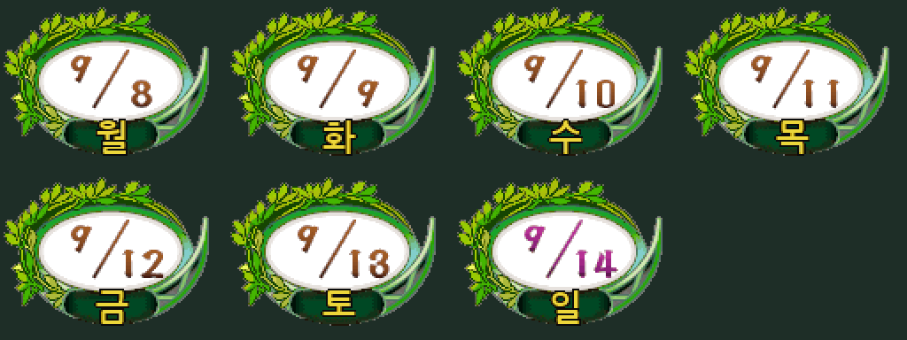
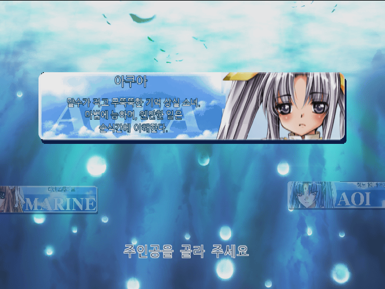
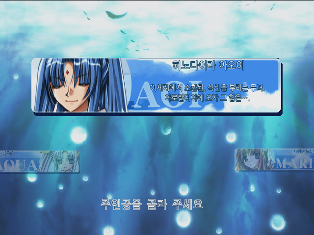
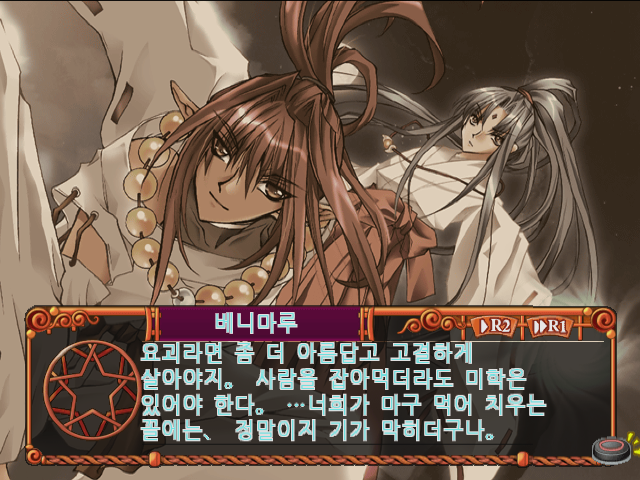
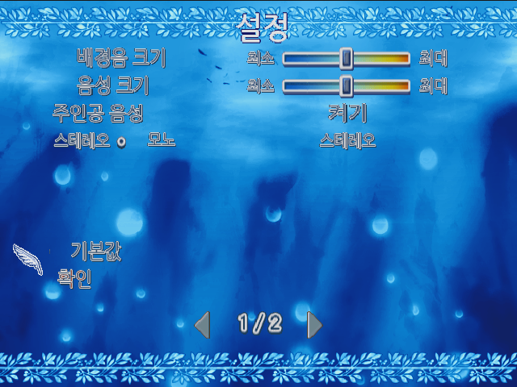

# 판타스틱 포츈 2: 트리플 스타 한글 패치 v0.9.2

PlayStation 2 일본판 **Fantastic Fortune 2: Triple Star (SLPS-25396)**용 비공식 한글 패치입니다.

대사·선택지 82,647개에 원문과 앞뒤 맥락을 대조한 1차 검수를 반영했습니다. 시스템·이름 입력 294항목, 이미지 165장의 문구 525개도 한글화했습니다. 모든 루트와 엔딩의 실제 플레이 검수는 아직 진행 중입니다.

## 다운로드

[**v0.9.2 패치 다운로드**](https://github.com/Jungsik-won/Fantastic-Fortune-2-Triple-Star-Korean-Translation/releases/tag/v0.9.2)

처음 적용할 때는 아래 **GUI 꾸러미**를 받으세요. Python을 설치하거나 명령어를 입력할 필요가 없습니다. 패치 파일이 앱에 포함돼 있습니다. v0.9의 검수와 v0.9.1의 선택 카드 개선을 유지하고 요일 표시 217개의 색상 오류와 식자를 수정했습니다. GUI 1.2에는 v0.9.2 패치가 포함돼 있습니다.

| 사용 환경 | 다운로드 |
| --- | --- |
| Windows 64비트 | [GUI 꾸러미](https://github.com/Jungsik-won/Fantastic-Fortune-2-Triple-Star-Korean-Translation/releases/download/v0.9.2/FF2-Korean-Patcher-GUI-1.2-windows-x64.zip) |
| Mac Apple Silicon (M1·M2·M3·M4 등) | [GUI 꾸러미](https://github.com/Jungsik-won/Fantastic-Fortune-2-Triple-Star-Korean-Translation/releases/download/v0.9.2/FF2-Korean-Patcher-GUI-1.2-macos-apple-silicon.zip) |
| Mac Intel | [GUI 꾸러미](https://github.com/Jungsik-won/Fantastic-Fortune-2-Triple-Star-Korean-Translation/releases/download/v0.9.2/FF2-Korean-Patcher-GUI-1.2-macos-intel.zip) |

## GUI로 적용하기

1. 사용 환경에 맞는 GUI 꾸러미를 압축 해제합니다.
2. Windows에서는 `FF2-Korean-Patcher.exe`, Mac에서는 `FF2-Korean-Patcher.app`을 엽니다.
3. **‘원본 ISO 선택 → 자동 패치’**를 누르고 일본판 SLPS-25396 원본 ISO를 선택합니다.
4. 원본 확인·패치·완성 ISO 검증이 끝나면 **‘완성 파일 폴더 열기’**를 누릅니다.

원본과 같은 폴더에 `원본 이름 (Korean v0.9.2).iso`가 생성됩니다. 같은 이름이 이미 있으면 번호를 붙여 저장합니다. 원본과 기존 파일은 덮어쓰지 않습니다. 쓰기 권한이 없는 폴더라면 ISO 선택 전에 ‘저장 폴더 변경’을 사용하세요.

원본 ISO를 앱이나 서버로 업로드하지 않습니다. 패치 작업은 인터넷 연결 없이 컴퓨터 안에서 진행됩니다. 일반적으로 약 3.1 GiB 이상이 필요하며, 일부 USB/외장 저장소의 대체 복사에서는 약 6.1 GiB 이상의 여유 공간이 필요할 수 있습니다.

Mac 앱은 개발자 공증을 받지 않았습니다. macOS가 실행을 차단하면 시스템 설정 → 개인정보 보호 및 보안에서 앱 이름과 출처를 확인한 뒤 ‘그래도 열기’를 사용할 수 있습니다.

**GUI 실행 확인:** Windows x64, Mac Apple Silicon, Mac Intel에서 실제로 빌드한 앱의 시작·ISO 선택·작업 스레드·완료 표시를 검사했습니다. 적용 엔진의 파일 보호·오류·취소·2 GiB 초과 처리 검사 23개를 통과했고, macOS에서 실제 3.2GB 원본 ISO의 결과 해시가 v0.9.2 검증 ISO와 일치함을 확인했습니다. 게임 플레이 확인 환경은 아래에 별도로 적었습니다.

## 기존 명령행 적용 방법

기존 `ff2-ko-full-reviewed-v092-package.zip`은 명령행 적용용으로 계속 받을 수 있습니다. 패치 형식은 xdelta가 아닌 `ff2patch` 차분 형식이며, GUI에는 이 패치가 포함돼 있어 별도 선택이 필요 없습니다.

Python 3을 사용하는 기존 방법:

```sh
python3 ff2.py apply \
  'Fantastic Fortune 2 - Triple Star (Japan).iso' \
  ff2-ko-full-reviewed-v092.ff2patch.gz \
  'Fantastic Fortune 2 - Triple Star (Korean Reviewed v0.9.1).iso'
```

`Original ISO SHA-256 mismatch`가 나오면 아래 원본 해시와 비교하세요. 다른 덤프나 이미 수정한 ISO에는 적용되지 않습니다. 원본을 덮어쓰지 않으며, 출력 파일 이름은 아직 존재하지 않는 이름으로 지정해야 합니다.

- 원본 크기: **3,231,907,840바이트**
- 원본 SHA-256: `a92f19c3402592aaabd0f1c4fdd67a839c32cde5cd133e861c16bacca8322ac7`
- 적용 후 ISO SHA-256: `e32176c41b3e1979e470c19c6b95f335c60d119f08474f6de33e24ad51565b0c`

PCSX2에서 생성한 ISO로 **새로 부팅**하세요. 이전 버전의 에뮬레이터 상태 저장을 불러오면 옛 글꼴·번역·실행 코드가 남아 있을 수 있습니다. 확인 환경은 **macOS / PCSX2 2.6.3**입니다. 다른 운영체제에서의 게임 플레이 검증은 아직 진행하지 않았습니다.

## v0.9.2 요일 표시 수정

31종 날짜 이미지의 요일 표시 217개를 다시 만들었습니다. 원본이 사용하는 64개 색상 범위를 지켜 잘못된 색상 줄무늬를 제거했고, 투명 배경 가장자리의 흰 잡음을 없앴습니다. 금색 글자와 어두운 외곽선을 다시 합성하고 글자 크기와 정렬을 조정했습니다. 날짜 숫자와 배지 장식은 유지합니다.



위 이미지는 실제 수정 리소스를 원본 배지에 합성한 미리보기입니다. 요일·색상 범위·날짜 숫자 보존과 ISO 적용 검증을 마쳤습니다. 오래 진행해야 나오는 날짜 장면의 실제 게임 표시는 사용자가 확인할 예정입니다.

## v0.9.1 선택 화면 수정

마린·아쿠아·아오이의 펼친 카드와 접힌 카드 6장을 다시 식자했습니다. 단색 파란 덮개를 제거하고 구름 배경과 영문 장식을 복원했습니다. 원래 얼굴 픽셀과 투명도를 유지하며 이름·설명 크기와 줄 배치를 조정하고 소개 문장을 다듬었습니다. 다른 이미지 화면은 이번 식자 수정 범위에 포함되지 않습니다.

## 반영 내용

- 마린 25,342개, 아쿠아 25,373개, 아오이 25,616개, 추가 이야기 6,316개의 대사·선택지 검수
- 인물별 말투·호칭, 주체·부정 표현, 관용구와 어색한 직역 수정
- 대사 표시 폭과 네 줄 높이를 고려한 배치, 이름 변수 최대 여섯 글자 여유 확보
- 글자 기준선 통일, 단어 사이 공백을 약 반칸으로 조정
- 원본 분위기에 맞춘 파란 글자와 흰 외곽선, 설정 메뉴의 흰 테두리 합성 오류 수정
- ‘최대’, ‘스테레오’ 등 설정 문구가 잘리던 영역 조정
- 한글 이름 입력과 기본 이름 지원

음성·음악·영상과 영문 고유 로고는 원본을 유지합니다. PS2 자체 글꼴을 사용하는 메모리 카드 제목은 영문 게임명입니다.

## 확인한 범위와 남은 검증

전체 82,941개 문자열의 인코딩·제어문자·이름 변수·필드 길이·표시 폭과 높이 검사에서 오류 0건, 회귀 검사 40개 통과를 확인했습니다. 원본과 수정 ISO 크기가 같고 지정 변경 구간 밖의 모든 바이트도 같음을 검사했습니다.

v0.9.1에서 새로 부팅해 세 주인공의 펼친 카드와 접힌 카드 표시를 확인했습니다.

v0.9에서 PCSX2 2.6.3의 기본 EE 재컴파일러로 새로 부팅하여 설정 두 페이지와 아오이 초반을 확인했습니다. 자동 입력 24회로 서로 다른 비어 있지 않은 대사 22개가 진행됐으며, 메모리 내 글꼴·코드·색상 검사 8개를 통과했습니다.

모든 루트·엔딩과 실제 컨트롤러의 장시간 진행은 아직 확인하지 않았습니다. 초반에 다음 대사로 넘어가지 않았다는 제보는 해당 장면이 특정되지 않아 재현하지 못했습니다. 이 증상의 해결을 확정한 버전은 아닙니다.

오류 제보는 [Issues](https://github.com/Jungsik-won/Fantastic-Fortune-2-Triple-Star-Korean-Translation/issues)에 패치 버전, PCSX2 버전, 주인공·장면, 화면과 재현 순서를 남겨 주세요.

## 실제 실행 화면










## 저장소 구성

- `gui/`: GUI 적용 도구와 Windows·Mac 빌드 스크립트
- `tests/`: GUI 적용 엔진의 파일 보호·오류 처리 검사
- `tools/`: 기존 명령행 적용 도구. 전체 개발 자료가 아닌 배포용 도구입니다.
- `screenshots/`: 실제 실행 확인 화면
- `SHA256SUMS.txt`: 릴리스 파일의 SHA-256
- `release-manifest.json`: 대상 버전과 검증 범위

패치 파일은 Releases에서 배포합니다.
